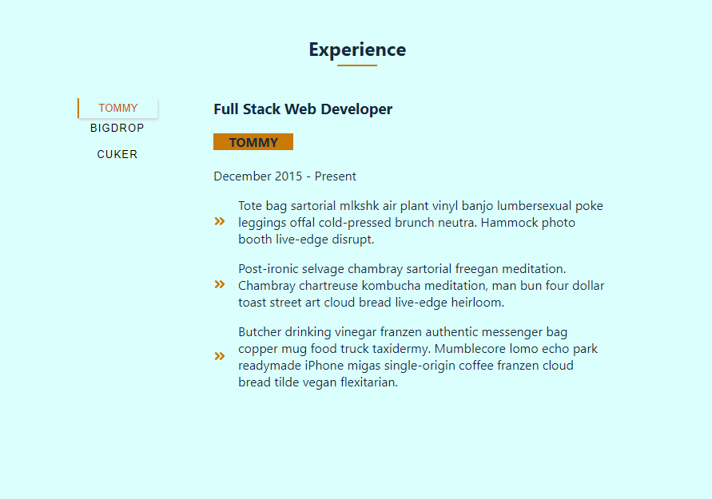
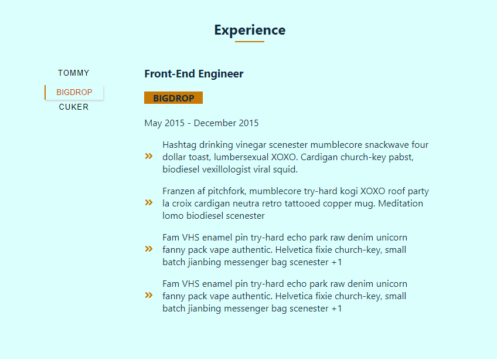
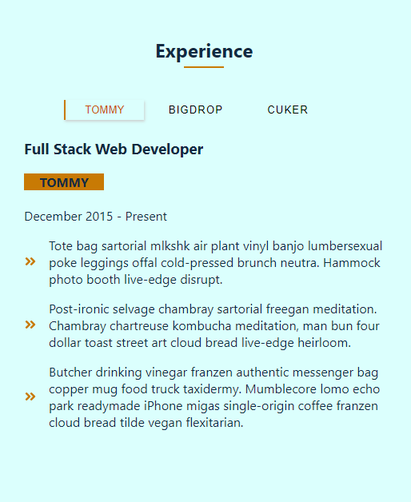

# Tab
A Minor React Project

Completed the "Tab Project", another minor project built using the React Library

In this project I fetched data from an API using the asyn-await function, this data
is then rendered to browser using the react functional component. In this project I made 
used of the react useState and useEffect hook.
Below is the implementation of the "tab" project

# Desktop View of the Tab project 

# Mobile View of the Tab Project

